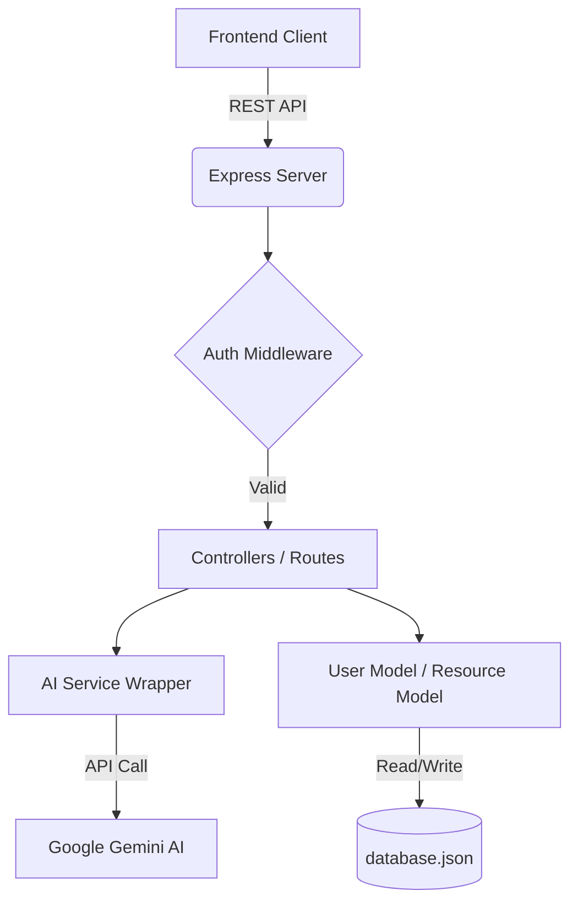

# CareerSathi - AI Career Guidance Portal

A clean, minimal, and AI-powered career guidance portal designed specifically for underprivileged students.

---

## Overview

- **What problem does this project solve?** Career counseling is often expensive, inaccessible, or generic. Underprivileged students frequently lack guidance on scholarships, modern career paths, and resume building. This platform democratizes career counseling by providing an intelligent, personalized AI mentor accessible for free.
- **Who is it for?** High school and college students, specifically those from underprivileged or underrepresented backgrounds seeking career direction, financial aid (scholarships), and professional development.
- **Why was it built?** To provide a zero-setup, highly accessible educational tool that leverages generative AI to bridge the career guidance gap. It was built as a structured college engineering project focused on rapid learning and zero complex dependencies.
- **Key goals:** Provide accurate AI career assessments, automate resume reviews, and curate a dynamic hub of free educational resources and scholarships.
- **Main workflow:** User registers $\rightarrow$ Completes Psychometric Quiz $\rightarrow$ AI generates personalized career matches $\rightarrow$ User builds/uploads Resume $\rightarrow$ AI reviews Resume $\rightarrow$ User interacts with AI Mentor for ongoing guidance.

---

## Architecture Overview

CareerSathi follows a monolithic Client-Server architecture utilizing a lightweight Node.js/Express backend and a Vanilla JS (or React in v2) frontend. It utilizes a **Zero-Setup Philosophy**, meaning it uses a local JSON file (`database.json`) for persistence instead of a heavy external database. 

### High-Level Architecture
- **Client (Frontend):** Handles UI, user interactions, and client-side routing.
- **Server (Backend):** Express API that processes business logic, auth, and communicates with the AI engine.
- **AI Engine:** Google Gemini API (`gemini-1.5-flash`) processes prompts injected with user profile context.
- **Persistence Layer:** Native File System (`fs`) operations reading/writing to a local JSON structure.

### Request Lifecycle Diagram

```mermaid
sequenceDiagram
    participant Client
    participant ExpressApp
    participant AuthMiddleware
    participant RouteHandler
    participant GeminiAPI
    participant LocalJSONDB

    Client->>ExpressApp: HTTP Request (e.g., /api/chat)
    ExpressApp->>AuthMiddleware: Verify JWT
    AuthMiddleware-->>ExpressApp: Token Valid (User ID)
    ExpressApp->>RouteHandler: Process Request Payload
    RouteHandler->>LocalJSONDB: Fetch User Context (Profile/Resume)
    LocalJSONDB-->>RouteHandler: User Data
    RouteHandler->>GeminiAPI: Prompt + Context (generateContent)
    GeminiAPI-->>RouteHandler: AI Response Text
    RouteHandler->>Client: JSON Response (200 OK)
```



### Component Diagram



---

## Project Structure

```text
project/
├── backend/
│   ├── middleware/      # Auth and Admin role verifications
│   ├── models/          # Custom User.js logic for JSON DB interactions
│   ├── routes/          # API endpoint controllers (auth, chat, assessment, etc.)
│   ├── database.json    # Local persistent storage
│   ├── db.js            # File system read/write wrappers
│   └── server.js        # Main Express application entry point
├── frontend/            # v1 Frontend (Vanilla JS + Bootstrap)
│   ├── css/             # Custom stylesheets
│   ├── js/              # Vanilla JS logic (auth.js, chat.js, assessment.js, etc.)
│   └── *.html           # View templates
├── frontend-v2/         # v2 Frontend (React + Vite + Tailwind)
│   ├── src/
│   │   ├── components/  # Reusable UI components
│   │   ├── context/     # React Context (AuthContext)
│   │   ├── pages/       # Route views (Dashboard, etc.)
│   │   └── store/       # Zustand state management
│   ├── tailwind.config.js
│   └── vite.config.ts
└── docs/                # Project documentation (API, Setup)
```

### Folder Responsibilities
- **`backend/routes/`**: Contains the core business logic handling HTTP requests, integrating with Gemini, and shaping responses.
- **`backend/models/`**: Abstracts the database logic. `User.js` handles finding, creating, and updating users in the JSON file.
- **`frontend/`**: The stable, zero-build step client. Serves static files directly via Express.
- **`frontend-v2/`**: A modern rewrite of the frontend utilizing React ecosystem, designed for better state management and component reusability.

---

## Tech Stack

### Frontend (v1 & v2)
- **HTML5/CSS3**
- **Vanilla JavaScript** (v1)
- **React.js 19** (v2)
- **Vite** (v2 Build Tool)

### Backend
- **Node.js**
- **Express.js**

### Database
- **Local JSON Database** (Zero-setup custom implementation using Node `fs`)

### AI
- **Google Gemini API** (`@google/generative-ai` SDK, `gemini-1.5-flash` model)

### Authentication
- **JSON Web Tokens (JWT)**
- **Bcrypt.js** (Password hashing)

### UI Libraries
- **Bootstrap 5** (v1)
- **Tailwind CSS** (v2)
- **Framer Motion** (v2 Animations)
- **Lucide React** (v2 Icons)

---

## Features

**Core Features**
- **AI Career Assessment:** A dynamic quiz that evaluates skills, interests, and background to recommend tailored career paths.
- **AI Resume Builder & Analyzer:** Upload a PDF resume; the system extracts text via `pdf-parse` and uses AI to provide constructive feedback and ATS optimization suggestions.
- **Smart AI Chat Mentor:** A conversational interface where students can ask career questions. The AI is context-aware, reading the student's saved profile and resume to provide personalized advice.
- **Resource Hub:** Curated lists of scholarships, free courses, and study materials.

**System Features**
- **JWT Authentication:** Secure stateless session management.
- **Role-Based Access Control (RBAC):** Dedicated Admin Dashboard to manage users and dynamically update platform resources.
- **Dynamic Profiles:** Users can update their education, skills, career goals, and family income data, which the AI utilizes for better context.

---

## Detailed Feature Explanation

### AI Career Assessment Workflow
1. User submits an array of quiz answers to `/api/assessment/submit`.
2. The backend retrieves the user's demographic and educational profile from the database.
3. A strict prompt is constructed instructing Gemini to act as a counselor and return a strictly formatted JSON string containing 3 recommended careers.
4. The backend parses the AI's JSON output, saves the recommendations to the user's profile, and sends it to the frontend.

### Resume Analyzer
1. User uploads a PDF to `/api/resume/upload`.
2. The endpoint uses `multer` (memory storage) to buffer the file.
3. `pdf-parse` extracts raw text from the buffer.
4. The text is saved to the user's profile and sent to Gemini with a prompt asking for 3-5 constructive improvements.

---

## System Design Decisions

- **Local JSON Database:** Chosen to adhere to a strict "Zero-Setup" philosophy. It eliminates the need for MongoDB connection strings or Docker containers, making it incredibly easy for students to clone and run the project immediately.
- **Google Gemini API:** Chosen over OpenAI due to Google's generous free tier for developers, faster response times (`flash` model), and large context window which is excellent for analyzing long resume texts.
- **Dual Frontend Architecture:** Maintained v1 (Vanilla JS) for ultimate simplicity and beginners, while building v2 (React) to demonstrate modern component-based architecture and state management scalability.

---

## Code Organization

- **Modules:** Backend is modularized into Express Routers (e.g., `chat.js`, `auth.js`).
- **Middleware:** `auth.js` verifies JWTs and attaches `req.userId`. `admin.js` verifies if the user role is 'admin'.
- **Services/Models:** Database interaction is isolated in `db.js` and `User.js`, ensuring route handlers don't directly manipulate the JSON strings.

---

## Installation

### Clone
```bash
git clone https://github.com/yourusername/careersathi.git
cd careersathi
```

### Install Backend Dependencies
```bash
cd backend
npm install
```

### Configure Environment
Create a `.env` file in the `backend` folder:
```bash
GEMINI_API_KEY=your_google_gemini_api_key_here
JWT_SECRET=your_super_secret_key
PORT=5000
```

### Run (Development)
```bash
# Inside the backend folder
npm run dev
```
The server will start on `http://localhost:5000` and serve the v1 Vanilla JS frontend automatically.

---

## Environment Variables

| Variable | Required | Description |
|---|---|---|
| `GEMINI_API_KEY` | Yes | API key from Google AI Studio for generative AI features. |
| `JWT_SECRET` | Yes | Secret string used to sign and verify JSON Web Tokens. |
| `PORT` | No | Port for the Express server (defaults to 5000). |

---

## Configuration

- **`backend/package.json`**: Defines server scripts (`start`, `dev` using nodemon) and dependencies like `express`, `jsonwebtoken`, `bcryptjs`, `pdf-parse`.
- **`frontend-v2/tailwind.config.js`**: Custom Tailwind theme defining brand colors (primary `#7C5CFF`), spacing, border radii, and soft box shadows.
- **`frontend-v2/vite.config.ts`**: Vite configuration for the React build pipeline.

---

## Database Design

Since the project uses a custom local JSON database, there are no traditional relational tables or MongoDB collections. Data is stored in `backend/database.json`.

**Schema Structure:**
```json
{
  "users": [
    {
      "_id": "1691234567890",
      "name": "John Doe",
      "email": "john@example.com",
      "role": "user",
      "passwordHash": "$2b$10$...",
      "resumeText": "Extracted text...",
      "education": "High School",
      "assessmentCompleted": true,
      "lastRecommendations": [...]
    }
  ],
  "resources": [
    {
      "id": 1,
      "title": "Khan Academy",
      "category": "Courses"
    }
  ]
}
```
**Relationships:** 
Data is largely denormalized. Users contain their own assessment results and resume text inline to simplify file I/O operations.

---

## API Documentation

### Auth
- **POST `/api/auth/register`**: Registers user, hashes password, returns JWT.
- **POST `/api/auth/login`**: Authenticates user, returns JWT.
- **GET `/api/auth/me`**: Returns current authenticated user profile.

### AI Chat & Assessment
- **POST `/api/chat`**: (Auth Required) Sends prompt to Gemini, returns markdown response.
- **POST `/api/assessment/submit`**: (Auth Required) Submits quiz answers, returns AI-generated career JSON array.

### Resume
- **POST `/api/resume/upload`**: (Auth Required) Accepts `multipart/form-data` PDF, extracts text, returns AI feedback.

### Admin
- **GET `/api/admin/users`**: (Admin Required) Returns list of all registered users.
- **POST `/api/admin/resources`**: (Admin Required) Creates a new global resource.
- **DELETE `/api/admin/resources/:id`**: (Admin Required) Deletes a global resource.

---

## Authentication

The platform uses stateless **JSON Web Tokens (JWT)**.
1. **Login Flow:** User submits email/password $\rightarrow$ Server hashes password and compares via `bcrypt` $\rightarrow$ Server signs a JWT payload `{ userId }` with `JWT_SECRET` $\rightarrow$ Token sent to client.
2. **Session:** The client stores the token in `localStorage` (v1) and attaches it to the `Authorization: Bearer <token>` header for subsequent requests.
3. **Middleware:** `authMiddleware` intercepts protected routes, verifies the token signature, and attaches `req.userId` for the controller to use.

---

## Security

- **Encryption:** Passwords are never stored in plaintext; they are hashed using `bcryptjs` with a salt round of 10.
- **Authorization:** Admin endpoints utilize an `adminMiddleware` that checks the user's `role` property before allowing DB modifications.
- **Validation:** Basic payload validation exists in route controllers to ensure required fields (like emails, prompts, PDF mimetypes) are present before processing.

---

## Performance Optimizations

- **In-Memory File Buffering:** The `/api/resume/upload` endpoint uses Multer's memory storage to buffer the PDF in RAM rather than writing to disk first, speeding up the parsing process.
- **AI Prompt Truncation:** Extracted resume text is truncated using `.substring(0, 10000)` before being sent to Gemini to prevent exceeding token limits and reduce latency.

---

## Error Handling

- **Route Level:** `try/catch` blocks wrap all asynchronous DB and AI operations.
- **Global Error Handler:** An Express middleware at the end of the stack catches unhandled errors, logs the stack trace to the console, and returns a generic `500 Internal Server Error` to prevent exposing stack traces to the client.

---

## Logging

Standard Node.js `console.error` and `console.log` are used for debugging and tracking server initialization, AI API failures, and request errors.

---

## Testing

Currently relies on manual testing. 
- API testing can be conducted using Postman or cURL against `localhost:5000`.
- Frontend flows are tested manually in the browser.

---

## Deployment

Because the application relies on a local file system (`database.json`) for persistent storage, deploying to serverless platforms like Vercel (which have ephemeral/read-only file systems) will result in data loss on every function restart.

**Recommended Platforms:**
- **Railway / Render:** Deploy as a standard Node.js Web Service with a persistent Disk attached to the `/backend` directory.
- **VPS / EC2:** Clone the repo, run `npm install`, and use `PM2` to keep the server alive.

---

## Scalability

**Current Bottleneck:** The custom `db.js` wrapper reads and parses the entire `database.json` file synchronously for every request. Under high concurrent load, this will block the Node.js event loop and cause severe performance degradation.

**Suggestions for Improvement:**
1. Migrate the data layer to **MongoDB (Mongoose)** or **PostgreSQL (Prisma)**.
2. Implement caching for the `/api/resources` endpoint using Redis.
3. Add rate limiting (`express-rate-limit`) to AI endpoints to prevent abuse of the Gemini API quota.

---

## Future Roadmap

- [ ] Complete the React/Vite/Tailwind (frontend-v2) migration.
- [ ] Migrate `database.json` to MongoDB Atlas.
- [ ] Add Email Verification and Password Reset flows.
- [ ] Implement OAuth2 (Google Login).
- [ ] Add a visual roadmap generator (nodes/edges) based on AI output.

---

## Screenshots

*(Placeholders - replace with actual images of the platform)*


---

## Demo

[Link to Live Demo Placeholder] - *Coming soon*

---

## License

This project is licensed under the MIT License - see the [LICENSE](LICENSE) file for details.

---

## Contributing

We welcome contributions! 
1. Fork the repository.
2. Create your feature branch (`git checkout -b feature/AmazingFeature`).
3. Commit your changes (`git commit -m 'Add some AmazingFeature'`).
4. Push to the branch (`git push origin feature/AmazingFeature`).
5. Open a Pull Request.

---

## Maintainer

Built and maintained by **Antigravity**. 
*Passionate about building scalable software and AI-driven educational tools.*

---

## Acknowledgements

- Google for providing the generous Gemini API tier.
- The open-source community for Express, React, and Tailwind.

---

## Badges


---

## SEO Description

CareerSathi is a free, AI-powered career guidance portal utilizing Google Gemini to provide personalized career assessments, resume reviews, and tailored educational roadmaps for underprivileged students.

---

## Quick Start

```bash
git clone https://github.com/yourusername/careersathi.git
cd careersathi/backend
npm install
echo "GEMINI_API_KEY=your_key_here\nJWT_SECRET=secret" > .env
npm start
```
Open `http://localhost:5000`

---

## FAQ

**Q: Do I need MongoDB to run this?**
A: No! The project uses a local JSON file for zero-setup ease of use.

**Q: How do I access the Admin Panel?**
A: Register a user with the email `admin@careersathi.com`.

**Q: Why is my AI Mentor failing to respond?**
A: Ensure your `GEMINI_API_KEY` is correctly set in the backend `.env` file and that you haven't exceeded Google's rate limits.

---

## Troubleshooting

- **Error: `Failed to fetch resources` or empty dashboard data**
  - **Solution:** Ensure `database.json` has read/write permissions on your OS.
- **Error: `Only PDF files are allowed` during resume upload**
  - **Solution:** Ensure you are uploading a valid `.pdf` extension file, as Word documents (`.docx`) are not supported by the current parser.

---

## Architecture Summary

CareerSathi is an elegantly simple, monolithic Node.js web application that serves a Vanilla HTML/JS frontend and exposes a RESTful API. Its defining characteristic is the absence of a heavy database layer, relying instead on local JSON persistence to ensure absolute ease of setup. By tightly integrating the Google Gemini Generative AI SDK, the lightweight application delivers powerful, context-aware business logic (resume parsing, dynamic quiz evaluation, conversational mentoring) usually reserved for complex, distributed enterprise systems.
