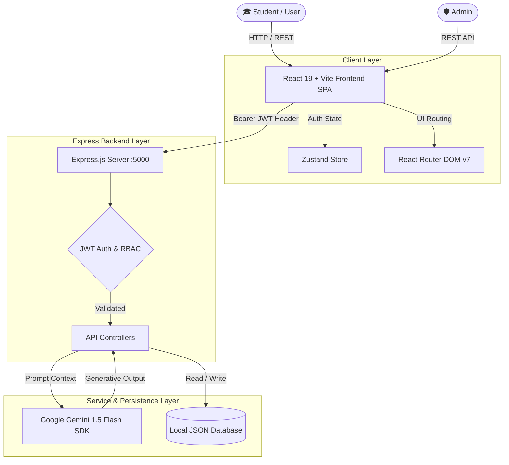
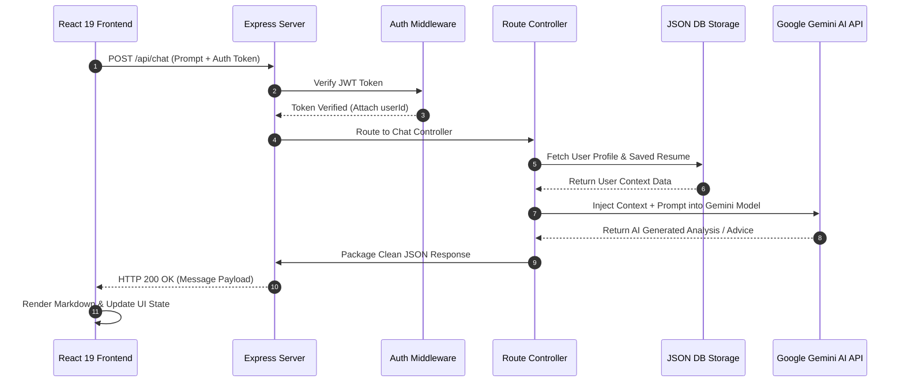

<div align="center">

# 🎓 CareerSathi (करियर साथी) 
### *Empowering Underprivileged Students with Next-Gen AI Career Guidance*

[](https://react.dev/)
[](https://www.typescriptlang.org/)
[](https://vitejs.dev/)
[](https://nodejs.org/)
[](https://expressjs.com/)
[](https://tailwindcss.com/)
[](https://ai.google.dev/)
[](LICENSE)

<br />

> **CareerSathi** is an end-to-end, zero-cost, AI-powered career counseling and mentorship portal designed to bridge the opportunity gap for underprivileged and underrepresented students. Powered by Google Gemini 1.5 Flash, modern React 19, and a zero-setup Express architecture.

</div>

---

## 📋 Table of Contents

- [✨ Overview \& Problem Statement](#-overview--problem-statement)
- [🚀 Key Features](#-key-features)
- [🏗️ System Architecture](#️-system-architecture)
  - [High-Level Data Flow](#high-level-data-flow)
  - [Request Lifecycle Diagram](#request-lifecycle-diagram)
- [🛠️ Tech Stack](#️-tech-stack)
- [📂 Comprehensive Repository Structure](#-comprehensive-repository-structure)
- [📥 Quick Start \& Local Setup](#-quick-start--local-setup)
  - [Prerequisites](#prerequisites)
  - [Backend Setup](#1-backend-setup)
  - [Frontend v2 Setup](#2-frontend-v2-react--vite-setup)
- [🔑 Environment Variables](#-environment-variables)
- [📡 API Documentation](#-api-documentation)
- [🎨 Design Aesthetics \& UI System](#-design-aesthetics--ui-system)
- [🔒 Security \& Data Privacy](#-security--data-privacy)
- [⚡ Performance Optimizations](#-performance-optimizations)
- [🗺️ Future Roadmap](#️-future-roadmap)
- [🤝 Contributing](#-contributing)
- [📄 License](#-license)

---

## ✨ Overview & Problem Statement

### The Problem
Access to professional career counseling, resume optimization, and personalized skill roadmaps is often expensive, centralized in urban hubs, or out of reach for students from low-income or underprivileged backgrounds. As a result, millions of talented students miss out on scholarships, modern tech careers, and career growth opportunities.

### The Solution: CareerSathi
CareerSathi democratizes career counseling by providing an intelligent, personalized, and 100% free AI guidance ecosystem:
1. **Psychometric AI Assessment**: Dynamically evaluates aptitude, soft skills, and personal background to generate tailored career trajectories.
2. **Context-Aware AI Mentor**: A continuous conversational companion that remembers the student's profile, education level, and career aspirations.
3. **Interactive Career Roadmaps**: Step-by-step visual learning paths for top modern professions (Software Engineering, Data Science, AI/ML, Cybersecurity, Cloud Architecture).
4. **AI Resume Builder & ATS Reviewer**: Instant resume scoring, text extraction from PDFs, ATS keyword matching, and PDF generation.
5. **Curated Free Resource Hub**: A centralized, searchable portal for scholarships, free courses, certifications, and mentorship initiatives.
6. **Unified Admin Console**: Complete management interface for resource updates, platform analytics, user role moderation, and real-time logs.

---

## 🚀 Key Features

| Feature Module | Capabilities |
| :--- | :--- |
| 📊 **Interactive Dashboard** | Real-time career match index, quick action shortcuts, active applications tracker, deadline countdowns, and skill progress widgets. |
| 🎯 **AI Career Assessment** | Multi-phase question engine evaluating logical reasoning, interest areas, and background to output structured career match analytics. |
| 🤖 **AI Mentor Chat Hub** | Real-time assistant powered by Gemini 1.5 Flash, equipped with preset prompts, context sidebar, syntax-highlighted responses, and model selection. |
| 🗺️ **Interactive Roadmaps** | Visual node-based learning tracks complete with estimated timeframes, prerequisite topics, recommended free resources, and PDF exports. |
| 📄 **Resume Builder & ATS** | PDF text extraction (`pdf-parse`), instant AI resume critique, skill keyword recommendations, live preview, and one-click PDF generation. |
| 📚 **Scholarship & Course Hub** | Categorized list of verified scholarships and free courses with filter controls, search, and bookmarking functionality. |
| 🛡️ **Admin Console** | System metrics, user management modal, resource editor, role management, and live activity log streams. |
| 🌓 **Modern UI/UX** | Dark/Light mode, custom Tailwind color tokens, glassmorphism card surfaces, and accessible responsive layouts. |

---

## 🏗️ System Architecture

CareerSathi utilizes a decoupled, modern client-server architecture:
- **Frontend (v2)**: Built with React 19, TypeScript, Vite, Tailwind CSS, Zustand, and Framer Motion for high-performance Single Page Application (SPA) delivery.
- **Frontend (v1)**: Lightweight Vanilla HTML5/JS client for low-bandwidth or legacy environments.
- **Backend API**: Node.js & Express server handling JWT authentication, request validation, and AI prompt engineering.
- **AI Core**: Google Gemini 1.5 Flash API wrapper for fast, context-driven natural language generation.
- **Zero-Setup Database**: In-memory JSON file system abstraction (`database.json`) enabling zero-configuration setup for immediate deployment and evaluation.

### High-Level Data Flow



### Request Lifecycle Diagram



---

## 🛠️ Tech Stack

### **Frontend (`frontend-v2`)**
- **Framework**: React 19.0.0
- **Language**: TypeScript 5.7+
- **Build Tool**: Vite 6.0+
- **Styling**: Tailwind CSS 3.4+, Vanilla CSS Variables
- **Icons**: Lucide React
- **State Management**: Zustand
- **Animations**: Framer Motion
- **Data Visualization**: Recharts
- **PDF Generation**: jsPDF, html2canvas

### **Backend (`backend`)**
- **Runtime**: Node.js 18+ / 20+
- **Framework**: Express.js 4.21+
- **Authentication**: JSON Web Tokens (`jsonwebtoken`), `bcryptjs`
- **File Parsing**: `multer`, `pdf-parse`
- **AI Integration**: `@google/generative-ai` (Gemini 1.5 Flash)
- **Security**: CORS, Environment variable isolation

---

## 📂 Comprehensive Repository Structure

```text
Online Career Guidance Portal for Underprivileged Students/
├── backend/                              # Express Node.js API Server
│   ├── middleware/                       # Authentication & Authorization middlewares
│   │   ├── admin.js                      # RBAC check for admin endpoints
│   │   └── auth.js                       # JWT verification middleware
│   ├── models/                           # Data access abstraction
│   │   └── User.js                       # Custom User model & JSON DB helper
│   ├── routes/                           # API Route Controllers
│   │   ├── admin.js                      # Admin console management API
│   │   ├── assessment.js                 # Psychometric assessment API
│   │   ├── auth.js                       # Register, Login, Me endpoints
│   │   ├── chat.js                       # AI Mentor chat completion API
│   │   ├── dashboard.js                  # User dashboard aggregation API
│   │   ├── resources.js                  # Scholarship & course management API
│   │   └── resume.js                     # PDF parse & resume critique API
│   ├── .env.example                      # Template for backend environment variables
│   ├── database.json                     # Local JSON database file
│   ├── db.js                             # File System (fs) read/write utility
│   ├── package.json                      # Backend dependencies & scripts
│   └── server.js                         # Server entry point & CORS configuration
│
├── frontend-v2/                          # Modern React 19 + TypeScript SPA
│   ├── public/                           # Static public assets & branding logos
│   ├── src/
│   │   ├── assets/                       # Images, icons, static graphic files
│   │   ├── components/                   # UI Component Library
│   │   │   ├── dashboard/                # AIMentorCard, CareerMatchCard, StatCard, TaskTable...
│   │   │   ├── layout/                   # TopNavbar, Sidebar, CommandMenu, NotificationDrawer...
│   │   │   └── ui/                       # Button, Card, Badge, Input, Switch, Logo...
│   │   ├── context/                      # React Context providers (AuthContext)
│   │   ├── pages/                        # Page View Containers
│   │   │   ├── Admin/                    # Admin Dashboard & Console Modal
│   │   │   ├── Assessment/               # Landing, Question Engine, Processing, Results
│   │   │   ├── Auth/                     # Login & Signup screens
│   │   │   ├── Dashboard/                # Main Student Overview Dashboard
│   │   │   ├── Mentor/                   # AI Mentor Chat Area, Prompts, Context Panel
│   │   │   ├── Profile/                  # User Profile settings & skill badges
│   │   │   ├── Resources/                # Scholarship & Free Course Search Hub
│   │   │   ├── ResumeBuilder/            # Resume Form Builder & PDF Analyzer
│   │   │   ├── Roadmaps/                 # Interactive Career Skill Roadmaps
│   │   │   └── Settings/                 # Preferences & Theme toggles
│   │   ├── store/                        # Global state management via Zustand
│   │   ├── App.tsx                       # App Router & Layout Shell
│   │   ├── index.css                     # Design System CSS, Tailwind imports, themes
│   │   └── main.tsx                      # React root rendering entry point
│   ├── package.json                      # Frontend dependencies & scripts
│   ├── tailwind.config.js                # Tailwind theme customization & tokens
│   ├── tsconfig.json                     # TypeScript compiler configuration
│   └── vite.config.ts                    # Vite build & plugin configurations
│
├── frontend/                             # Legacy Vanilla JS Frontend (v1 fallback)
├── DESIGN-cohere.md                      # UI/UX Design System Specification
└── README.md                             # Comprehensive Project Documentation
```

---

## 📥 Quick Start & Local Setup

### Prerequisites
- **Node.js**: v18.0.0 or higher ([Download Node.js](https://nodejs.org/))
- **npm**: v9.0.0 or higher
- **Google Gemini API Key**: Free key available from [Google AI Studio](https://aistudio.google.com/)

---

### 1. Backend Setup

1. Open your terminal and navigate to the `backend` directory:
   ```bash
   cd backend
   ```

2. Install dependencies:
   ```bash
   npm install
   ```

3. Create your `.env` file in the `backend` directory:
   ```bash
   cp .env.example .env
   ```
   *Or create it manually with the following content:*
   ```env
   PORT=5000
   JWT_SECRET=your_super_secret_jwt_key_careersathi_2026
   GEMINI_API_KEY=your_actual_google_gemini_api_key_here
   ```

4. Start the backend server in development mode:
   ```bash
   npm run dev
   ```
   *The backend server will run on **`http://localhost:5000`**.*

---

### 2. Frontend v2 (React + Vite) Setup

1. Open a new terminal window and navigate to `frontend-v2`:
   ```bash
   cd frontend-v2
   ```

2. Install dependencies:
   ```bash
   npm install
   ```

3. Start the Vite development server:
   ```bash
   npm run dev
   ```

4. Open your browser and navigate to:
   ```text
   http://localhost:5173
   ```

---

## 🔑 Environment Variables

### Backend (`/backend/.env`)

| Variable | Required | Default | Description |
| :--- | :---: | :---: | :--- |
| `PORT` | ❌ No | `5000` | Port number on which the Express server listens. |
| `JWT_SECRET` | ✅ Yes | - | Secret string used to sign and verify authentication JSON Web Tokens. |
| `GEMINI_API_KEY` | ✅ Yes | - | API key obtained from Google AI Studio for Gemini 1.5 Flash SDK calls. |

---

## 📡 API Documentation

### 🔐 Authentication Endpoints (`/api/auth`)

| Method | Endpoint | Access | Description |
| :--- | :--- | :---: | :--- |
| `POST` | `/api/auth/register` | Public | Registers a new user, hashes password, returns JWT token. |
| `POST` | `/api/auth/login` | Public | Authenticates credentials, returns JWT token. |
| `GET` | `/api/auth/me` | Protected | Fetches authenticated user's profile and progress metrics. |

### 🤖 AI Mentor & Assessment Endpoints

| Method | Endpoint | Access | Description |
| :--- | :--- | :---: | :--- |
| `POST` | `/api/chat` | Protected | Sends user prompt + context to Gemini API, returns AI response. |
| `POST` | `/api/assessment/submit` | Protected | Processes psychometric quiz responses and generates career matches. |

### 📄 Resume Endpoints (`/api/resume`)

| Method | Endpoint | Access | Description |
| :--- | :--- | :---: | :--- |
| `POST` | `/api/resume/upload` | Protected | Accepts PDF upload (`multipart/form-data`), extracts text, returns AI feedback. |

### 📚 Resource & Dashboard Endpoints

| Method | Endpoint | Access | Description |
| :--- | :--- | :---: | :--- |
| `GET` | `/api/resources` | Public | Lists all curated scholarships, courses, and learning resources. |
| `GET` | `/api/dashboard/stats` | Protected | Fetches aggregated user metrics, task deadlines, and progress statistics. |

### 🛡️ Admin Endpoints (`/api/admin`)

| Method | Endpoint | Access | Description |
| :--- | :--- | :---: | :--- |
| `GET` | `/api/admin/users` | Admin | Retrieves list of registered users and system usage analytics. |
| `POST` | `/api/admin/resources` | Admin | Adds a new global scholarship or educational resource item. |
| `DELETE` | `/api/admin/resources/:id` | Admin | Removes a resource item by ID. |

---

## 🎨 Design Aesthetics & UI System

CareerSathi follows strict, high-end web design principles designed to inspire confidence and ease of use:
- **Palette**: Deep slate dark backgrounds (`#0B0F19`), vibrant primary indigo/purple accents (`#6366F1`, `#8B5CF6`), soft glassmorphism surface layers (`rgba(255, 255, 255, 0.05)`).
- **Typography**: Clean, readable sans-serif layout powered by Inter / System fonts with balanced leading.
- **Interactivity**: Micro-animations on hover, smooth transitions via Framer Motion, skeleton loaders during AI generation states.
- **Accessibility**: High-contrast text ratios, clear focus indicators, full keyboard command menu (`Ctrl + K`).

---

## 🔒 Security & Data Privacy

1. **Password Safety**: Passwords are standardly hashed using `bcryptjs` with salt round factors before saving to database storage.
2. **Stateless JWT Authorization**: Sensitive routes require a valid `Bearer <token>` HTTP header verified on every request.
3. **Role-Based Protection**: Admin endpoints enforce strict role checks (`req.user.role === 'admin'`) returning `403 Forbidden` for non-authorized attempts.
4. **Environment Isolation**: API keys and secrets are isolated inside `.env` and never exposed in client bundles.

---

## ⚡ Performance Optimizations

- **Vite Code Splitting**: Frontend bundles are modularized using Vite's dynamic imports, keeping initial page load sizes light.
- **In-Memory File Parsing**: PDF resume extractions parse directly from RAM buffers (`multer.memoryStorage()`) without writing temporary files to disk.
- **Prompt Engineering Truncation**: Resume text content is normalized and capped at optimal token length to ensure rapid 1-2 second responses from Gemini 1.5 Flash.

---

## 🗺️ Future Roadmap

- [x] Complete React 19 + TypeScript + Vite modern migration (`frontend-v2`).
- [x] Interactive step-by-step career roadmaps with downloadable guides.
- [x] Full-stack Admin Console with user role management.
- [ ] MongoDB Atlas / PostgreSQL database driver connection layer.
- [ ] Multi-language support (Hindi, Marathi, Tamil, Bengali) for regional accessibility.
- [ ] Direct Mentor-Student video integration and scheduling system.

---

## 🤝 Contributing

We welcome contributions from students, developers, and educators!

1. **Fork** the repository.
2. **Create** your feature branch:
   ```bash
   git checkout -b feature/AwesomeFeature
   ```
3. **Commit** your changes:
   ```bash
   git commit -m "feat: Add AwesomeFeature"
   ```
4. **Push** to the branch:
   ```bash
   git push origin feature/AwesomeFeature
   ```
5. **Open** a Pull Request.

---

## 📄 License

Distributed under the **MIT License**. See `LICENSE` for more details.

<br />

<div align="center">
  <b>CareerSathi — Bridging the Gap in Education with Generative AI</b><br />
  <i>Built with ❤️ for Underprivileged Students Worldwide</i>
</div>
