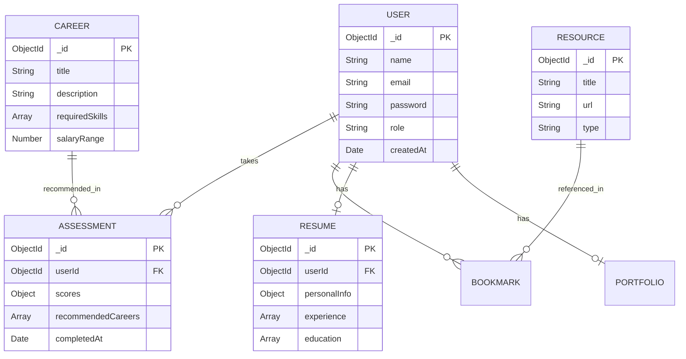

# Database Documentation

CareerSathi uses **MongoDB** as its primary data store, managed through **Mongoose** ORM.

## Entity Relationship Diagram (ERD)

## Collections & Schemas

### 1. Users Collection
Stores authentication and profile information.
- **Indexes**: 
  - `email` (Unique, 1)
  - `role_1_createdAt_-1` (Compound)

### 2. Assessments Collection
Stores the results of user psychometric tests.
- **Relationships**: Refers to `User`.
- **Indexes**: `userId` (1)

### 3. Careers Collection
Master list of career paths mapped by the recommendation engine.
- **Indexes**: `title` (Text)

### 4. Resources Collection
Links to external courses, videos, and articles.
- **Indexes**: `category` (1), `title` (Text)

### 5. Resumes Collection
Stores JSON structure of the user's resume data.
- **Relationships**: One-to-One with `User`.
- **Indexes**: `userId_1_createdAt_-1` (Compound)

### 6. Portfolios Collection
Stores public portfolio configurations.
- **Relationships**: One-to-One with `User`.
- **Indexes**: `userId` (1)

## Performance & Optimization

- **Connection Pooling**: Mongoose is configured with `maxPoolSize: 100` and `minPoolSize: 10` to handle high concurrency.
- **Caching**: Frequently accessed data (like public resources and career dictionaries) are cached in Redis to reduce database read pressure.
- **Timeouts**: `serverSelectionTimeoutMS: 5000` is enforced to fail fast on connection issues.
